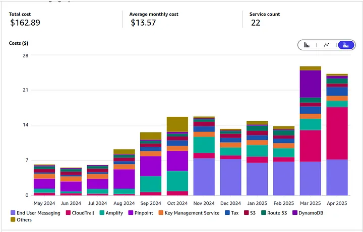
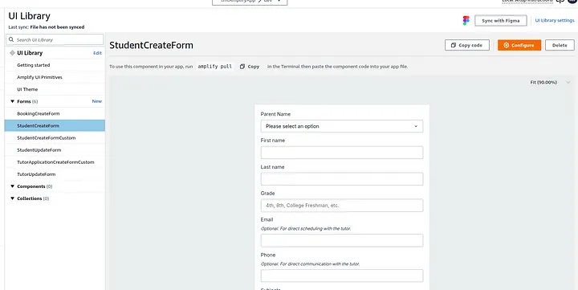

As a one-person team managing backend services for a few businesses, finding a reliable and efficient Backend as a Service (BaaS) is crucial. For the past three years, AWS Amplify has been that service for me. Given AWS’s reputation for solid infrastructure, my initial assessment remains largely positive: it’s a good platform, albeit with its own specific way of doing things. It has enabled me to deliver features and manage operations effectively, proving to be a powerful tool for a lean team. So, would I use it again? Perhaps, but not without acknowledging some significant points of friction I’ve encountered along the way.

## Infrastructure and the Gen 1 to Gen 2 Transition

One of the most significant points of contention has been the slow transition from Amplify Gen 1 to Gen 2. While Gen 2, announced in 2024, promises a more developer-friendly, code-first approach built on AWS CDK templates (a welcome change from the more rigid CloudFormation templates of Gen 1), the lack of a seamless official conversion tool has been a letdown. I’m still reliant on the older tools for my existing projects.

Ideally, I’d prefer working with a tool like Terraform, which offers greater flexibility and a clearer infrastructure-as-code approach compared to CloudFormation. I’ve been looking at that CloudFormation console for years, and the nested stacks and rollback features still seem like a mystery to me. While the Gen 2 move towards CDK is a step in the right direction, the delayed and perhaps clunky migration path dampens the excitement.

## Database Challenges: The NoSQL Trap with DynamoDB

The database experience with Amplify, primarily leveraging DynamoDB, starts deceptively simply. At first, it’s pretty nice. The Amplify Studio UI allows for easy creation of data models, which initially feels intuitive. However, this interface, and the $index and @connection directives, subtly encourage a relational (SQL) database design mindset. It sounds great, it's a trap. This approach fundamentally clashes with the optimal usage patterns of a NoSQL database like DynamoDB.

DynamoDB thrives on access patterns being defined upfront, often requiring denormalization and careful planning of Partition and Sort Keys, along with Global Secondary Indexes (GSIs). Trying to apply a SQL-like schema design to DynamoDB through Amplify’s data modeling tools feels like a trap. You either end up duplicating and nesting data across multiple tables to reduce the need for complex joins (which DynamoDB isn’t built for) or cramming everything into one table and relying on intricate Sort Keys and GSIs for querying.

The flexibility of SQL databases like PostgreSQL, allowing for easy pivoting, summing, and aggregation, is something I deeply miss. While Amplify introduced the @searchable directive to push data to an OpenSearch cluster for more flexible searching, this comes at an added cost, of course. My workaround has been using DynamoDB streams and Lambda functions to create aggregated tables for summary data – a pattern that works but is obviously a workaround for the limitations of the database within the Amplify context. Comparing this to the inherent capabilities of a PostgreSQL database in a service like Supabase highlights a significant drawback of the Amplify/DynamoDB pairing for certain use cases. Part of me really wishes I had gone with Supabase because of the PostgreSQL database.

## Cost Considerations

On the financial front, Amplify has been quite cost-effective for my needs. The cost has been great! Comparing my average monthly bill of around $14 (which includes costs for services like SES for email and SNS for texts) to the $25/month starting tier of Supabase, Amplify certainly seems to win purely on price for my current usage. However, this cost analysis feels a bit petty when considering the development overhead and workarounds necessitated by using DynamoDB instead of a more flexible SQL database like PostgreSQL offered by Supabase. The features and ease of querying a SQL database could potentially justify a higher cost for many projects.

## UI Component Experience: A Disappointing Detour

Initially, I drank the Kool-Aid and went all in at first with the AWS Amplify UI components. I won’t do that again. I was drawn by the promise of converting Figma designs and auto-generating forms based on data models. This turned out to cause me so many hours of rewrites. The system felt clunky.

Compared to mature and popular UI libraries like Shadcn, MUI, or Mantine, Amplify UI components fall short. These alternative libraries offer greater flexibility, better performance, and a more extensive range of well-designed components. Furthermore, with the rise of AI code generation tools, building custom components with these established libraries is often faster and results in cleaner, more maintainable code than relying on the sometimes painfully slow Amplify codegen process. My experience here led to many wasted hours and a decision to avoid them in the future.

## Additional Core Amplify Features

Beyond the areas mentioned, Amplify also provides robust solutions for other essential BaaS functionalities:

### Authentication
Amplify integrates seamlessly with Amazon Cognito to provide a fully managed user directory. Setting up various authentication flows, including email/password, social logins (Google, Facebook, etc.), and multi-factor authentication (MFA), is relatively straightforward. This is a critical component for most applications, and Amplify handles it quite well, offering both pre-built UI components (though I preferred building my own using the underlying libraries) and fine-grained access control rules tied to user groups and ownership. Its cheap, BUT the docs are rough and it pisses me off that you can’t change the group claims after creation. Migrating cognito user pools is a too much of a hassle.

### APIs (GraphQL and REST)
Amplify simplifies the creation of both GraphQL APIs (powered by AWS AppSync) and REST APIs (powered by Amazon API Gateway and AWS Lambda). While I focused on the database challenges with GraphQL’s data modeling, the ability to quickly set up endpoints and connect them to backend logic (often implemented using Lambda functions) is a core strength. Defining resolvers or Lambda handlers allows you to implement custom business logic.

### Functions (AWS Lambda)
As I mentioned using Lambda for DynamoDB workarounds, it’s worth noting that Amplify makes it relatively easy to add and manage AWS Lambda functions. These can be triggered by API calls, database events (like DynamoDB streams), or other AWS services, providing a flexible way to add custom server-side logic without managing servers.

These features are fundamental to a BaaS, and Amplify’s integration with the broader AWS ecosystem provides a lot of power and scalability potential, even if some aspects require a deeper understanding of the underlying AWS services.

## Conclusion: A Mixed Bag with Potential

After three years, my experience with AWS Amplify is a mixed bag. It has been instrumental in allowing me to operate efficiently as a solo developer, providing a unified platform for deploying fullstack applications on AWS. The cost-effectiveness for my current scale is a definite plus, and core features like Authentication and API management are robust.

However, the pain points, particularly the awkward fit between Amplify’s data modeling and DynamoDB’s NoSQL nature, and the disappointing UI components, are significant. The slow and uncertain transition to Gen 2 adds another layer of frustration. While the move towards a code-first, CDK-based Gen 2 is promising and might address some of the infrastructure rigidity, the database challenge remains a major consideration.

For future projects, the appeal of a SQL-first BaaS like Supabase is strong due to the inherent flexibility of PostgreSQL. Whether I choose Amplify again will heavily depend on the specific project requirements, particularly the database needs, and the maturity and migration story of Amplify Gen 2. It’s a powerful tool, mostly because of the underlying maturity and potency of AWS Services like API Gateway, AppSync, and DynamoDB, but one that requires navigating its quirks and being prepared for workarounds, especially when deviating from its preferred patterns.