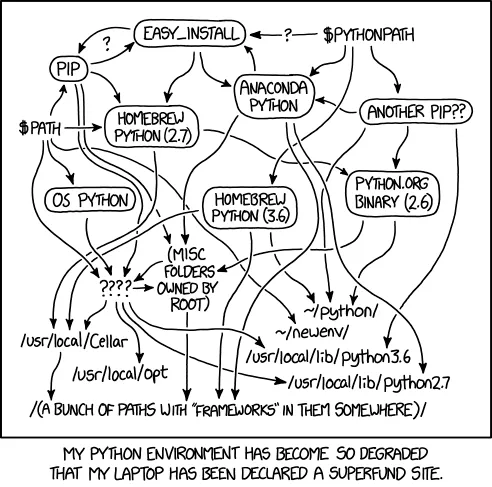

Tired of slow `pip` installs, confusing virtual environments, and messy `requirements.txt` files? Meet **UV**, the new Python package installer and manager that's changing the game. UV is super fast, easy to use, and much better than older tools like `pip`, `virtualenv`, and even `poetry`.

I’ve started to use it and forget about all the headaches and duplicate python installs I’ve had. Fancy new [MCP projects](https://glama.ai/mcp/servers/@ReAPI-com/mcp-openapi#:~:text=of%20API%20development.-,Cursor%20Configuration,-To%20integrate%20the) and [common data validation libraries](https://github.com/pydantic/pydantic) are using it because it just makes sense. Just look for a uv.lock file in your favorite python repo.

UV fixes a lot of common headaches for Python developers. It helps you ditch old habits like `requirements.txt` (which was never really meant to be a standard) and the hassle of activating virtual environments. With UV, your projects become cleaner, more reliable, and a lot more fun to work with.

This article will show you the best parts of UV and why you should start using it today.


# **1. Get Started Fast: How to Install UV**

Installing UV is quick and simple. You can usually get it running with [just one command](https://github.com/astral-sh/uv?tab=readme-ov-file#installation):

Once it’s installed, you’ll immediately notice how much faster UV is compared to what you’re used to. Also note that the preferred installation is a standalone binary. This helps it to be outside of the traditional python path issues where py shims, pypath, and other alias paths have made python versions and binaries a tougher-than-necessary installation.

# **2. Cleaner Scripts: No More** `requirements.txt` **for One-Offs, Hello PEP 723 and** `pyproject.toml`

For years, Python developers have relied on `requirements.txt` to list their project's dependencies. The dirty little secret I found out a few months ago is `requirements.txt` was never meant to be a standard. It was just an implementation detail created by the `pip` team that accidentally became the norm. This often led to messy dependency management, especially for larger applications.

**The Modern Python Way:** `pyproject.toml` **(PEP 621, since 2020)**

For full-fledged applications, multi-file projects, and libraries, the official and recommended way to declare your project’s dependencies is using `pyproject.toml`, specifically following **PEP 621**. This standard has been around since 2020 and provides a clear, structured, and central place for all your project's metadata, including its dependencies. UV fully supports `pyproject.toml` for managing your application's dependencies. It even has development dependancies all set.

I worked for a company that has multiple files and a paragraph how to use them in README. Getting `requirements.txt` , `requirements-dev.txt` , and `requirements-async.txt` if a symptom of a system that needs to evolve.

**Example** `pyproject.toml` **for an application:**

```toml
# pyproject.toml
[project]
name = "my-awesome-app"
version = "0.1.0"
description = "A multi-file Python application"
dependencies = [
    "requests>=2.30",
    "fastapi~=0.100",
    "uvicorn[standard]",
]
```

UV will read this file to understand and install your application’s dependencies, making `requirements.txt` obsolete for these kinds of projects.

**The UV Way for _Single-File Scripts_: PEP 723**

While `pyproject.toml` is excellent for applications, what about those quick, self-contained Python scripts you write for automation, data processing, or little utilities? This is where **PEP 723** comes in, and UV embraces it perfectly. I’ve used it for lots of data processing, database migrations, and more.

**The Problem with Old Ways for Scripts:** Sharing a single Python script often meant you also had to provide a `requirements.txt` file and explain how to set up a virtual environment and install dependencies. It was extra work for something that should be simple.

**The UV Solution with PEP 723:** UV, working with PEP 723, lets you embed your script’s dependencies directly within the script itself using a special comment block. This makes your single-file scripts truly self-contained and super easy to share. This is ideal for “one-off” scripts, helper utilities, or anything that doesn’t need a full `pyproject.toml` setup.

**Here’s how it looks for a simple script:**

```python
# /// script
# dependencies = ["requests", "beautifulsoup4"]
# ///
import requests
from bs4 import BeautifulSoup

def get_page_title(url):
    response = requests.get(url)
    soup = BeautifulSoup(response.text, 'html.parser')
    return soup.title.string if soup.title else "No title found"
if __name__ == "__main__":
    url = "https://www.example.com"
    print(f"Title of {url}: {get_page_title(url)}")
```

**How it works:** When you run this script with `uv` (like `uv run your_script.py`), UV automatically finds the `dependencies` block. It then quickly sets up a temporary environment, installs the listed packages, and runs your script. No more `venv` commands or `pip install` steps for simple scripts! This clean separation means you use the right tool for the job: `pyproject.toml` for applications and PEP 723 for your handy one-off scripts.

I’ve even seen someone put shebang lines at the top, making this file executable from a bash settings. [Article Link](https://github.com/astral-sh/uv?tab=readme-ov-file#installation). This now makes it a possible replacement for small scripts written in go or rust because they were simple and flexible executable files.

# **3. Supercharge Your CI/CD: Fast and Cached Builds with GitLab**


[Source](https://media.licdn.com/dms/image/v2/C5612AQGtYBNvl_yiYQ/article-cover_image-shrink_600_2000/article-cover_image-shrink_600_2000/0/1651676443940?e=2147483647&v=beta&t=FhAKMIVHW_PAMInZDoDJ3R7TMB_xMKYi279M94rLDNI)

UV truly shines in automated testing and deployment setups like GitLab CI/CD. Its speed and smart caching can drastically cut down your build times.

UV is designed to be fast since it uses a single-threaded [tokio runtime](https://docs.rs/tokio/latest/tokio/). The uv pip install command is optimized for speed and works great with caching. You don’t even need to make a virtual environment yourself; UV handles it.

Here’s an updated GitLab CI/CD example using the latest UV image and caching tips:

[Source Docs](https://docs.astral.sh/uv/guides/integration/gitlab/)

```yaml
# .gitlab-ci.yml (UV way)
variables:
  UV_VERSION: "0.5" # Make sure this matches the latest UV version
  PYTHON_VERSION: "3.12"
  BASE_LAYER: bookworm-slim
  UV_LINK_MODE: copy # Needed for GitLab CI's build directory setup
  UV_CACHE_DIR: ".uv-cache" # Where UV stores its cache

stages:
  - build
  - test
uv-install:
  stage: build
  image: ghcr.io/astral-sh/uv:$UV_VERSION-python$PYTHON_VERSION-$BASE_LAYER
  cache:
    # Use uv.lock to make sure the cache changes when your dependencies change
    key:
      files:
        - uv.lock
    paths:
      - $UV_CACHE_DIR # Cache UV's internal package cache
      - .venv/        # Cache the virtual environment created by UV
    policy: pull-push
  script:
    # This command creates or updates the virtual environment
    # and installs dependencies from uv.lock (or pyproject.toml if no lock)
    - uv sync
    # Clean up the cache to save space
    - uv cache prune --ci
run_tests:
  stage: test
  image: ghcr.io/astral-sh/uv:$UV_VERSION-python$PYTHON_VERSION-$BASE_LAYER
  # Make sure this job can use the cache from the 'uv-install' job
  needs:
    - uv-install
  script:
    # Run your tests using uv run, which uses the managed environment
    - uv run pytest
```

**What this means for your CI/CD:**

*   **Faster Builds:** UV’s installer is super quick, making your CI/CD jobs run much faster.
*   **Smart Caching:** By caching `$UV_CACHE_DIR` and `.venv/` based on `uv.lock`, your pipeline runs will be lightning fast after the first one, especially for small code changes.
*   **Simpler Setup:** Your CI/CD script is cleaner because UV takes care of virtual environment management behind the scenes.
*   **Reliable Results:** UV’s lock files (we’ll talk about these next) ensure your CI/CD environment always uses the exact same package versions you tested locally.

# **4. Secure Private Repositories with** `.netrc`

Dealing with private Python packages can be annoying, often requiring you to put sensitive details directly in your code or in environment variables. UV has a better way: it works smoothly with `.netrc` files.

**The Problem:** Hardcoding usernames and passwords or using temporary environment variables for private package servers.

**The UV Solution:** UV uses your `~/.netrc` file. Just add an entry for your private package server, and UV will automatically use those login details when it installs packages from there.

**Example** `~/.netrc` **entry:**

```text
machine acme.gitlab.com
    login oauth2
    password thekrusty-krab-pizza-is-the-pizza-for-u-&-me
```

**How it works:** When UV needs a package from `your-private-repo.com` (as listed in your `pyproject.toml` or `uv.lock`), it will look up the login details in your `.netrc` file. This keeps your login info secure and out of your project files.

# **5. Helpful Tools:** `uvx` **for Ruff, Ty, and More!**

UV isn’t just about managing packages; it also has `uvx` to make your daily coding easier. `uvx` lets you run tools like linters and type checkers within a UV-managed environment without installing them globally.

uvx ruff for Quick Code Checks and Fixing:

Ruff is known for being an incredibly fast tool for checking and formatting Python code. uvx ruff makes it even better by running ruff with the exact versions needed for your project, without messing up your global Python setup.

```bash
uvx ruff .         # Check your whole project for style issues
uvx ruff --fix .   # Check and automatically fix style issues
```

This is super helpful for making sure everyone on your team follows the same code style.

While ruff handles code style, `uvx ty` (or `uvx mypy` for MyPy) helps you catch potential errors before you run your code. This leads to stronger, easier-to-maintain code. Overall, `ty` has helped a bit, but its far from being as comprehensive as MyPy currently.

```bash
uvx typ your_module.py # Run type checks on a specific file
uvx typ .              # Run type checks on your whole project
```

The great thing about `uvx` is that you don't need to manually `pip install ruff` or `mypy` in every virtual environment. `uvx` takes care of setting up these tools on the fly, making them instantly ready for your project.

# **6. Solid Projects with Lock Files**

UV strongly supports **lock files**. These files (often named `uv.lock`) pinpoint the exact version of _every single package_ your project needs, including those that your direct dependencies rely on.

**Why Lock Files are a Big Deal:**

*   **Reliable Projects:** Everyone working on the project, and your CI/CD systems, will use the exact same package versions. This stops the common “it works on my machine!” problem.
*   **Stable Updates:** Your project won’t break if a hidden dependency suddenly updates.

UV makes creating and using lock files simple:

This way, your `pyproject.toml` lists the general packages you want, and `uv.lock` records the _exact_ versions that actually get installed.

# **7. Migrating Scripts: Boto3 and Async Boto3 with UV**

UV is perfect for managing dependencies for migration scripts or other helper tools that interact with cloud services. Let’s say you need `boto3` (for AWS services) and `aioboto3` (for async AWS calls) for a database migration script.

Here’s how you’d set up a script that uses them with UV

```python
# db_migration_script.py
# /// script
# dependencies = ["boto3", "aioboto3"]
# ///

import asyncio
import boto3
import aioboto3

async def perform_async_db_backup(bucket_name, object_key, data):
    async with aioboto3.client("s3") as s3_client:
        await s3_client.put_object(Bucket=bucket_name, Key=object_key, Body=data)
    print("Got it coach")

def perform_sync_db_cleanup(table_name):
    dynamodb = boto3.resource('dynamodb', region_name='us-east-1') # Adjust region as needed
    table = dynamodb.Table(table_name)
    print("Aye aye captain")


async def main():
    await perform_async_db_backup("your-backup-bucket", "db_dump_20250701.json", b"some json data")
    perform_sync_db_cleanup("your-database-table")


if __name__ == "__main__":
    asyncio.run(main())
```

**How it helps:**

*   **Self-contained Migrations:** The script itself tells UV what it needs (`boto3`, `aioboto3`). When you run `uv run db_migration_script.py`, UV makes sure these are available.
*   **Easy Sharing:** Just share the script! No separate `requirements.txt` for this specific helper.
*   **Consistent Environments:** Whether you run it locally or in your CI/CD, UV creates the correct environment, preventing issues from missing packages. This is super important for critical tasks like database migrations.

# **8. No More Virtual Environment Mess**

One of the quieter but powerful benefits of UV is how it handles virtual environments. It avoids the confusing “virtual shim/alias hell” that some other tools create. UV manages environments cleanly, making them feel like a natural part of your project, not a separate, tricky layer you constantly have to wrestle with.



Source: [https://xkcd.com/1987/](https://xkcd.com/1987/)

# **Conclusion: Your Python Workflow, Made Easy**

UV is more than just a new tool; it’s a huge step forward for Python development. It brings speed, smart caching, modern best practices like PEP 723 and lock files, and handy utilities like `uvx` to the forefront. It tackles many of the annoying problems Python developers have faced for a long time.

If you’re still stuck with older ways of managing Python projects, now’s the time to switch. **Jump on the UV Python bandwagon. You won’t be disappointed.** Your development process will be smoother, faster, and much more enjoyable.

Comment and clap for the article if you learned something new! Or check out some of my other articles on medium or on https://medium.com/@BryMei